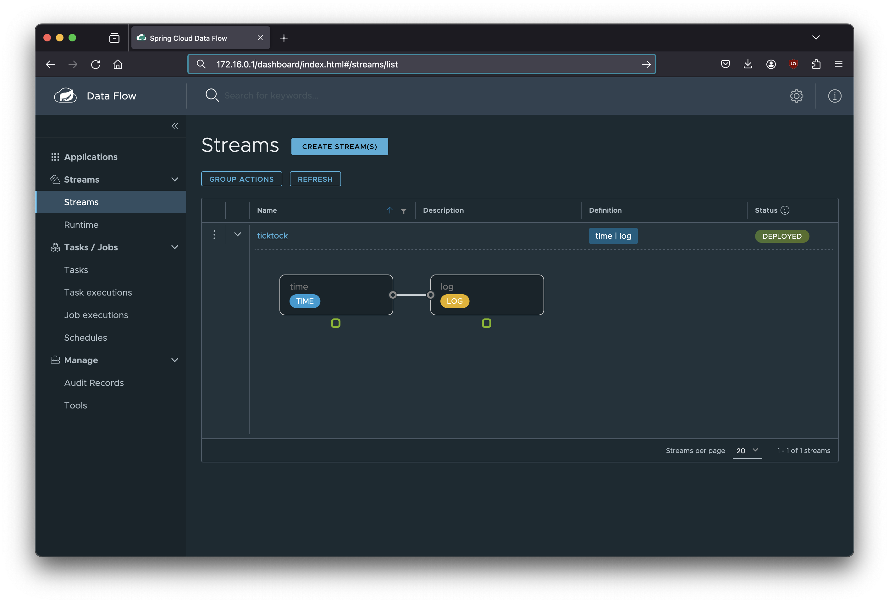
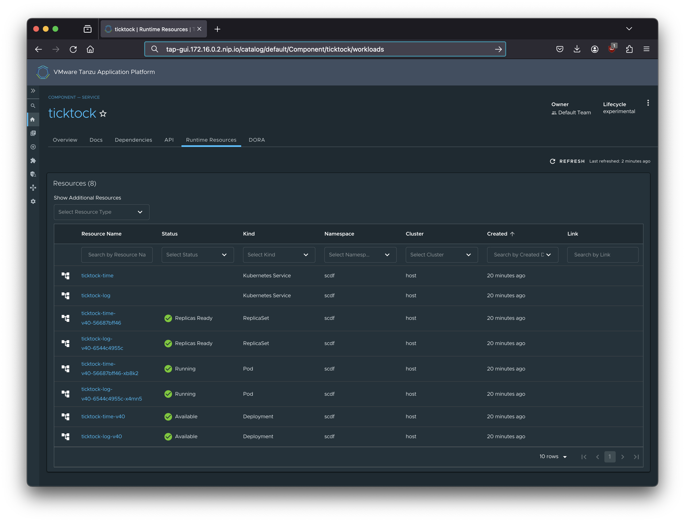

# Tanzu Application Platform and Spring Cloud Data Flow integration

 Tanzu Application Platform (TAP) and Spring Cloud Data Flow (SCDF) were developed independently so there is no explicit integration when you install both products.
 
 You can however add a few TAP resources that will provide some integration, allowing you to deploy streams using a custom TAP Workload and then view the applications making up the SCDF stream in TAP's Developer Portal.

> NOTE: The approach in this document have been tested with the most recent SCDF version 2.11.2 and TAP version 1.7.2 using a `full` profile.

## Install TAP using the full profile

Refer to the [TAP documentation](https://docs.vmware.com/en/VMware-Tanzu-Application-Platform/1.7/tap/overview.html).

## Install SCDF in the TAP cluster

We installed the SCDF system for Kubernetes using the [Bitnami Helm chart](https://bitnami.com/stack/spring-cloud-dataflow/helm). The namespace was specified as `scdf` and the service is installed on port 80 using `LoadBalancer`.

```sh
helm install scdf oci://registry-1.docker.io/bitnamicharts/spring-cloud-dataflow \
  --namespace scdf --create-namespace \
  --set server.service.type=LoadBalancer \
  --set server.service.ports.http=80
```

Once the `LoadBalancer` EXTERNAL-IP address has been assigned we need to capture it so we can access the SCDF API and UI.

You can use the following command to see the IP address assigned:

```sh
kubectl get -n scdf svc/scdf-spring-cloud-dataflow-server
```

You should see something like this:

```txt
NAME                                TYPE           CLUSTER-IP     EXTERNAL-IP     PORT(S)        AGE
scdf-spring-cloud-dataflow-server   LoadBalancer   10.40.14.146   172.16.0.1      80:31044/TCP   1d
```

You can now set an env var in your terminal:

```sh
export SCDF_URL=http://172.16.0.1
```

## Add the stream apps

In order to create a stream you need to have the stream apps that make up your stream registered with the SCDF server. You can either use the SCDF `shell` or make API calls using `curl` command.

We will register the Docker images for the `time` and `log` stream apps.

### Using the SCDF shell

You can download the most recent shell Java JAR file named `spring-cloud-dataflow-shell-2.11.2.jar` from [Maven Central](https://repo1.maven.org/maven2/org/springframework/cloud/spring-cloud-dataflow-shell/2.11.2/).

To start the shell you can run:

```sh
java -jar ./spring-cloud-dataflow-shell-2.11.2.jar --dataflow.uri=$SCDF_URL
```

where `SCDF_URL` was set in the previous section.

Once the shell is up and running you can register the two apps using:

```sh
app register --name time --type source --uri docker:springcloudstream/time-source-rabbit:4.0.0 --bootVersion 3
app register --name log --type sink --uri docker:springcloudstream/log-sink-rabbit:4.0.0 --bootVersion 3
```

### Using the SCDF API server

Using `curl` you can run the following commands to register the two apps:

```sh
curl "$SCDF_URL/apps/source/time?bootVersion=3" -i -X POST \
    -d 'uri=docker%3Aspringcloudstream/time-source-rabbit%3A4.0.0'
curl "$SCDF_URL/apps/sink/log?bootVersion=3" -i -X POST \
    -d 'uri=docker%3Aspringcloudstream/log-sink-rabbit%3A4.0.0'
```

## Create a supply-chain for the SCDF streams

We need to create a few resources for the supply-chain to be able to run a workload that can deploy a stream.

First we create a ClusterSupplyChain named `deploy-scdf-stream`. This is based on the `source-test-to-url` one that is part of the standard TAP install.

> [supply-chain/supply-chain.yaml](https://github.com/trisberg/tap-scdf/blob/main/supply-chain/supply-chain.yaml)
```yaml
apiVersion: carto.run/v1alpha1
kind: ClusterSupplyChain
metadata:
  name: deploy-scdf-stream
spec:
  params:
  - default: ""
    name: ca_cert_data
  - default: main
    name: gitops_branch
  - default: supplychain
    name: gitops_user_name
  - default: supplychain
    name: gitops_user_email
  - default: supplychain@cluster.local
    name: gitops_commit_message
  - default: ""
    name: gitops_ssh_secret
  - default: ""
    name: gitops_commit_branch
  resources:
  - name: source-provider
    params:
    - default: default
      name: serviceAccount
    - default: go-git
      name: gitImplementation
    templateRef:
      kind: ClusterSourceTemplate
      name: source-template
    sources:
    - name: source
      resource: source-deployer
  - name: source-deployer
    sources:
    - name: source
      resource: source-provider
    templateRef:
      kind: ClusterSourceTemplate
      name: scdf-stream-pipeline
  selectorMatchExpressions:
  - key: apps.tanzu.vmware.com/workload-type
    operator: In
    values:
    - scdf-stream
```

Then, we create the ClusterSourceTemplate for our `scdf-stream-pipeline` based on the template for the TAP standard `testing-pipeline`.

> [supply-chain/clustersourcetemplate.yaml](https://github.com/trisberg/tap-scdf/blob/main/supply-chain/clustersourcetemplate.yaml)
```yaml
apiVersion: carto.run/v1alpha1
kind: ClusterSourceTemplate
metadata:
  name: scdf-stream-pipeline
spec:
  healthRule:
    singleConditionType: Ready
  lifecycle: mutable
  params:
  - default:
      apps.tanzu.vmware.com/pipeline: scdf-stream
    name: scdf_pipeline_matching_labels
  revisionPath: .status.outputs.revision
  urlPath: .status.outputs.url
  ytt: "#@ load(\"@ytt:data\", \"data\")\n\n#@ def merge_labels(fixed_values):\n#@
    \  labels = {}\n#@   if hasattr(data.values.workload.metadata, \"labels\"):\n#@
    \    exclusions = [\"kapp.k14s.io/app\", \"kapp.k14s.io/association\"]\n#@     for
    k,v in dict(data.values.workload.metadata.labels).items():\n#@       if k not
    in exclusions:\n#@         labels[k] = v\n#@       end\n#@     end\n#@   end\n#@
    \  labels.update(fixed_values)\n#@   return labels\n#@ end\n\n#@ def merged_tekton_params():\n#@
    \  params = []\n#@   if hasattr(data.values, \"params\") and hasattr(data.values.params,
    \"scdf_pipeline_params\"):\n#@     for param in data.values.params[\"scdf_pipeline_params\"]:\n#@
    \      params.append({ \"name\": param, \"value\": data.values.params[\"scdf_pipeline_params\"][param]
    })\n#@     end\n#@   end\n#@   params.append({ \"name\": \"source-url\", \"value\":
    data.values.source.url })\n#@   params.append({ \"name\": \"source-revision\",
    \"value\": data.values.source.revision })\n#@   return params\n#@ end\n---\napiVersion:
    carto.run/v1alpha1\nkind: Runnable\nmetadata:\n  name: #@ data.values.workload.metadata.name\n
    \ labels: #@ merge_labels({ \"app.kubernetes.io/component\": \"test\" })\nspec:\n
    \ #@ if/end hasattr(data.values.workload.spec, \"serviceAccountName\"):\n  serviceAccountName:
    #@ data.values.workload.spec.serviceAccountName\n\n  runTemplateRef:\n    name:
    tekton-source-pipelinerun\n    kind: ClusterRunTemplate\n\n  selector:\n    resource:\n
    \     apiVersion: tekton.dev/v1beta1\n      kind: Pipeline\n\n    #@ not hasattr(data.values,
    \"scdf_pipeline_matching_labels\") or fail(\"scdf_pipeline_matching_labels
    param is required\")\n    matchingLabels: #@ data.values.params[\"scdf_pipeline_matching_labels\"]
    or fail(\"scdf_pipeline_matching_labels param cannot be empty\")\n\n  inputs:
    \n    tekton-params: #@ merged_tekton_params()\n"
```

And, finally we create the Tekton pipeline that will run the stream deployment.

> [supply-chain/pipeline.yaml](https://github.com/trisberg/tap-scdf/blob/main/supply-chain/pipeline.yaml)
```yaml
kind: Pipeline
metadata:
  name: scdf-stream
  labels:
    apps.tanzu.vmware.com/pipeline: scdf-stream
spec:
  params:
    - name: source-url
    - name: source-revision
  tasks:
    - name: deploy
      params:
        - name: source-url
          value: $(params.source-url)
        - name: source-revision
          value: $(params.source-revision)
      taskSpec:
        params:
          - name: source-url
          - name: source-revision
        steps:
          - name: deploy
            image: springdeveloper/scdf-shell:latest
            script: |-
              cd `mktemp -d`
              wget -qO- $(params.source-url) | tar xz -m
              export SCDF_URL=http://172.16.0.1
              /apply.sh $PWD/stream.yaml
              exit 0
```

> NOTE: We provide the URL for the SCDF server for this pipeline to use.

## Create an OCI image that can be used by the Tekton pipeline

The Tekton pipline relies on an OCI image to run the defined script for the pipline. We use the SCDF Shell as part of a `apply.sh` script combined with a `shell.sh` script for running the SCDF shell. We can package the SCDF shell JAR file in an image that has Java installed. Then we add the two shell scripts as well. This is the Dockerfile for this:

> [image/Dockerfile](https://github.com/trisberg/tap-scdf/blob/main/image/Dockerfile)
```
FROM eclipse-temurin:17-jdk

RUN mkdir /app
COPY spring-cloud-dataflow-shell-*.jar /app/spring-cloud-dataflow-shell.jar
COPY shell.sh shell.sh
RUN chmod +x shell.sh
COPY apply.sh apply.sh
RUN chmod +x apply.sh
```

We build this image and push to the tag `springdeveloper/scdf-shell:latest` that was used by the pipline definition.

The `apply.sh` script checks if the stream exists, if it does it updates it, otherwise it creates and deploys it.

> [image/apply.sh](https://github.com/trisberg/tap-scdf/blob/main/image/apply.sh)
```sh
#!/bin/bash

SHELL=/shell.sh
STREAM=$1

n=$(grep -e name: $STREAM)
name=${n##name: }
d=$(grep -e definition: $STREAM)
definition=${d##definition: }
dp=$(grep -e deploymentProperties: $STREAM)
deploymentProperties=${dp##deploymentProperties: }

echo "stream info $name" > exists.cmd
$SHELL --dataflow.uri=$SCDF_URL --spring.shell.commandFile=exists.cmd > exists.txt 2>&1
exists=$(grep ║$name exists.txt)

if [ -z "$exists" ]; then
  echo "CREATE $name"
  echo "stream create --name $name --definition \"$definition\" --deploy false" > stream.cmd
  echo "stream deploy --name $name --properties \"$deploymentProperties\"" >> stream.cmd
else
  echo "UPDATE $name"
  echo "stream update --name $name --properties \"$deploymentProperties\"" > stream.cmd
fi
$SHELL --dataflow.uri=$SCDF_URL --spring.shell.commandFile=stream.cmd > stream.txt 2>&1
cat stream.txt
```

## Create stream definition files

We create a Git repo to contain the files needed for the stream workload.

First a `stream.yaml` file to define the stream definition and deployment properties.

> [stream.yaml](https://github.com/trisberg/ticktock-stream/blob/main/stream.yaml)
```yaml
name: ticktock
description: Test stream for TAP
definition: time | log
deploymentProperties: app.time.date-format=YYYY-mm-dd,app.log.level=WARN
```

This is the classic SCDF sample stream that logs the time from the time app.

We need a `workload.yaml` file that references the supply-chain pipeline that we defined earlier using a label of `apps.tanzu.vmware.com/workload-type: scdf-stream`.

> [config/workload.yaml](https://github.com/trisberg/ticktock-stream/blob/main/config/workload.yaml)
```yaml
apiVersion: carto.run/v1alpha1
kind: Workload
metadata:
  name: ticktock-stream
  labels:
    apps.tanzu.vmware.com/workload-type: scdf-stream
    app.kubernetes.io/part-of: ticktock
spec:
  params:
  - name: scdf_pipeline_matching_labels
    value:
      apps.tanzu.vmware.com/pipeline: scdf-stream
  source:
    git:
      url: https://github.com/trisberg/ticktock-stream
      ref:
        branch: main
```

The final piece is the Backstage `catalog-info.yaml` catalog component file that will allow the TAP Developer Portal UI to display the runtime resources for our stream.

>[catalog/catalog-info.yaml](https://github.com/trisberg/ticktock-stream/blob/main/catalog/catalog-info.yaml)
```yaml
apiVersion: backstage.io/v1alpha1
kind: Component
metadata:
  name: ticktock
  description: TickTock Stream Apps
  tags:
    - spring
    - streaming
    - tanzu
  annotations:
    'backstage.io/kubernetes-label-selector': 'spring-group-id=ticktock'
spec:
  type: service
  lifecycle: experimental
  owner: default-team
  system: dataflow
```

## Trying it all out

### Create supply-chain

We are now ready to deploy our supply chain and pipeline:

```sh
kubectl apply -f ./supply-chain/supply-chain.yaml
kubectl apply -f ./supply-chain/clustersourcetemplate.yaml
kubectl apply -f ./supply-chain/pipeline.yaml
```

### Deploy workload

Once those files are applied we can create the worklod resource:

```sh
tanzu apps workload create ticktock -f https://raw.githubusercontent.com/trisberg/ticktock-stream/main/config/workload.yaml -y
```

After a minute or so the workload should have been processed and you should see it completed:

```txt
% tanzu apps workload get ticktock                        
📡 Overview
   name:        ticktock
   type:        scdf-stream
   namespace:   default

💾 Source
   type:       git
   url:        https://github.com/trisberg/ticktock-stream
   branch:     main
   revision:   main@sha1:ba89ba3007092433c172a2836d0d5f985a6b397b

📦 Supply Chain
   name:   deploy-scdf-stream

   NAME              READY   HEALTHY   UPDATED   RESOURCE
   source-provider   True    True      3m11s     gitrepositories.source.toolkit.fluxcd.io/ticktock
   source-deployer   True    True      2m36s     runnables.carto.run/ticktock

🚚 Delivery

   Delivery resources not found.

💬 Messages
   No messages found.

🛶 Pods
   NAME                        READY   STATUS      RESTARTS   AGE
   ticktock-rv22v-deploy-pod   0/1     Completed   0          3m4s

To see logs: "tanzu apps workload tail ticktock --timestamp --since 1h"
```

You can review the logs from the build pod:

```txt
% kubectl logs ticktock-rv22v-deploy-pod
Defaulted container "step-deploy" out of: step-deploy, prepare (init), place-scripts (init)
CREATE ticktock
Created new stream 'ticktock'
Deployment request has been sent for stream 'ticktock'
```

### View stream status with SCDF shell

The stream apps will be deployed in the `scdf` namespace and we can review the status using some SCDF shell commands:

```txt
dataflow:>stream list
╔═══════════╤═══════════╤═════════════════╤═════════════════════════════════════════╗
║Stream Name│Description│Stream Definition│                 Status                  ║
╠═══════════╪═══════════╪═════════════════╪═════════════════════════════════════════╣
║ticktock   │           │time | log       │The stream has been successfully deployed║
╚═══════════╧═══════════╧═════════════════╧═════════════════════════════════════════╝
```

```txt
dataflow:>stream info ticktock
╔════════╤════════════════════════════════════════════════════════════════════════════════════════════════════════════════════════════════════════════════════════════════════════════════════════════════════════════╤═══════════╤════════╗
║ Stream │                                                                                             Stream Definition                                                                                              │Description│ Status ║
║  Name  │                                                                                                                                                                                                            │           │        ║
╠════════╪════════════════════════════════════════════════════════════════════════════════════════════════════════════════════════════════════════════════════════════════════════════════════════════════════════════╪═══════════╪════════╣
║ticktock│time --management.endpoints.web.exposure.include=health,info,bindings --management.metrics.tags.application.type=${spring.cloud.dataflow.stream.app.type:unknown}                                           │           │deployed║
║        │--management.metrics.tags.stream.name=${spring.cloud.dataflow.stream.name:unknown}                                                                                                                          │           │        ║
║        │--management.metrics.tags.application=${spring.cloud.dataflow.stream.name:unknown}-${spring.cloud.dataflow.stream.app.label:unknown}-${spring.cloud.dataflow.stream.app.type:unknown}                       │           │        ║
║        │--time.date-format=YYYY-mm-dd --management.metrics.tags.instance.index=${vcap.application.instance_index:${spring.cloud.stream.instanceIndex:0}}                                                            │           │        ║
║        │--wavefront.application.service=${spring.cloud.dataflow.stream.app.label:unknown}-${spring.cloud.dataflow.stream.app.type:unknown}-${vcap.application.instance_index:${spring.cloud.stream.instanceIndex:0}}│           │        ║
║        │--management.metrics.tags.application.guid=${spring.cloud.application.guid:unknown}                                                                                                                         │           │        ║
║        │--management.metrics.tags.application.name=${vcap.application.application_name:${spring.cloud.dataflow.stream.app.label:unknown}} --wavefront.application.name=${spring.cloud.dataflow.stream.name:unknown} │           │        ║
║        │| log --management.endpoints.web.exposure.include=health,info,bindings --management.metrics.tags.application.type=${spring.cloud.dataflow.stream.app.type:unknown}                                          │           │        ║
║        │--management.metrics.tags.stream.name=${spring.cloud.dataflow.stream.name:unknown}                                                                                                                          │           │        ║
║        │--management.metrics.tags.application=${spring.cloud.dataflow.stream.name:unknown}-${spring.cloud.dataflow.stream.app.label:unknown}-${spring.cloud.dataflow.stream.app.type:unknown}                       │           │        ║
║        │--management.metrics.tags.instance.index=${vcap.application.instance_index:${spring.cloud.stream.instanceIndex:0}}                                                                                          │           │        ║
║        │--wavefront.application.service=${spring.cloud.dataflow.stream.app.label:unknown}-${spring.cloud.dataflow.stream.app.type:unknown}-${vcap.application.instance_index:${spring.cloud.stream.instanceIndex:0}}│           │        ║
║        │--management.metrics.tags.application.guid=${spring.cloud.application.guid:unknown} --log.level=WARN                                                                                                        │           │        ║
║        │--management.metrics.tags.application.name=${vcap.application.application_name:${spring.cloud.dataflow.stream.app.label:unknown}} --wavefront.application.name=${spring.cloud.dataflow.stream.name:unknown} │           │        ║
╚════════╧════════════════════════════════════════════════════════════════════════════════════════════════════════════════════════════════════════════════════════════════════════════════════════════════════════════╧═══════════╧════════╝

Stream Deployment properties: {
  "log" : {
    "spring.cloud.deployer.group" : "ticktock",
    "resource" : "docker:springcloudstream/log-sink-rabbit",
    "version" : "4.0.0",
    "spring.cloud.deployer.bootVersion" : "3"
  },
  "time" : {
    "spring.cloud.deployer.group" : "ticktock",
    "resource" : "docker:springcloudstream/time-source-rabbit",
    "version" : "4.0.0",
    "spring.cloud.deployer.bootVersion" : "3"
  }
}
```

### View stream status with SCDF Dashboard UI

You can open a browser for the SCDF Dashboard UI using:

```sh
open $SCDF_URL/dashboard
```

Once there you can select "Streams" in the left panel and you should see the `ticktock` stream deployed.



### View stream resources in TAP Developer Portal UI

Open the TAP Developer Portal (the TAP installation instructions should have provided a URL for you to use).

From the "Home" page click "REGISTER ENTITY" button and provide the "Repository URL" for the `catalog-info.yaml`. In the `ticktock` sample repo we have this file at this URL: https://github.com/trisberg/ticktock-stream/blob/main/catalog/catalog-info.yaml. Finish the registration using "ANALYZE" and then "IMPORT" buttons.

Click on "VIEW COMPONENT" and this brings up the component view. You can select the "Runtime Resources" tab to see the Kubernetes resources that belong to the `ticktock` stream apps.



### Update the stream properties

We can update the deployment properties for the stream.
Let's say we change the date format and push this change to the Git repository for the ticktock stream.
The supply-chain is monitoring the Git repository and when it detects this change it will launch another stream deployment.

```txt
% tanzu apps workload get ticktock
📡 Overview
   name:        ticktock
   type:        scdf-stream
   namespace:   default

💾 Source
   type:       git
   url:        https://github.com/trisberg/ticktock-stream
   branch:     main
   revision:   main@sha1:b5b54aa09f9605dac3dbd725fdab05d416a10f03

📦 Supply Chain
   name:   deploy-scdf-stream

   NAME              READY     HEALTHY   UPDATED   RESOURCE
   source-provider   True      True      43m       gitrepositories.source.toolkit.fluxcd.io/ticktock
   source-deployer   Unknown   Unknown   7s        runnables.carto.run/ticktock

🚚 Delivery

   Delivery resources not found.

💬 Messages
   No messages found.

🛶 Pods
   NAME                        READY   STATUS      RESTARTS   AGE
   ticktock-kdv75-deploy-pod   1/1     Running     0          10s
   ticktock-rv22v-deploy-pod   0/1     Completed   0          43m

To see logs: "tanzu apps workload tail ticktock --timestamp --since 1h"
```

We can see a second deploy-pod that is running. Let's look at the logs from that pod:

```txt
% kubectl logs ticktock-kdv75-deploy-pod
Defaulted container "step-deploy" out of: step-deploy, prepare (init), place-scripts (init)
UPDATE ticktock
Update request has been sent for the stream 'ticktock'
```

So, the `apply.sh` detected an existing `ticktock` stream and updated the deployment properties.
